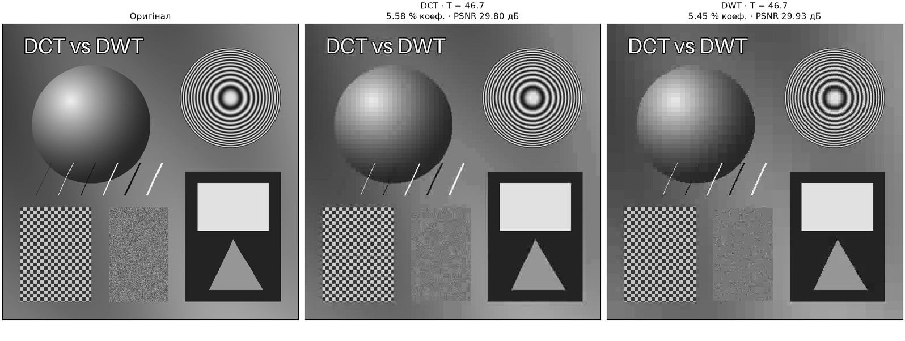
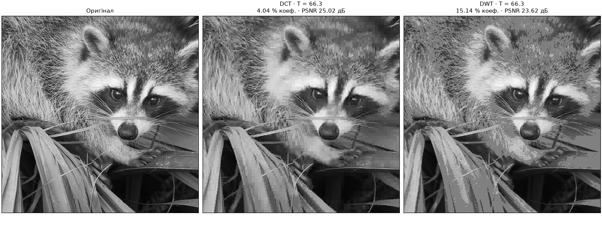

# Стиснення зображень: DCT vs DWT (Хаар)

Програма стискає зображення у відтінках сірого двома методами — блочним DCT 8×8 та багаторівневим вейвлет-перетворенням Хаара — і показує результати поряд: **Original | DCT | DWT** з PSNR, кількістю збережених коефіцієнтів і коефіцієнтами стиснення.

Обидва перетворення реалізовано власноруч (NumPy використовується лише для масивів і множення матриць); готові `dct()`, `idct()`, `dwt()`, `idwt()` не використовуються.

## Запуск

Подвійний клік на **`start.bat`**. Якщо віртуального середовища `.venv` ще немає або в ньому бракує залежностей (перший запуск або перерваний), він створює середовище і встановлює залежності (потрібен Python 3.10+ та інтернет), далі відкриває програму одразу.

`start.bat` приймає й параметри командного рядка (відносні шляхи рахуються від поточної теки); файл зображення можна також перетягнути на `start.bat`. Консоль відкривається лише для `--batch` і `-h`, інтерфейс — без неї:

| Команда | Що робить |
|---|---|
| `start.bat` | інтерфейс із синтетичним тестовим зображенням |
| `start.bat --photo` | інтерфейс із реальним фото (єнот) |
| `start.bat photo.jpg` | інтерфейс із вашим зображенням |
| `start.bat --photo --batch` | серія експериментів без інтерфейсу, звіт у нову підтеку `results/` |
| `start.bat --photo --batch --mode quant --levels "10;20;40;80"` | інший спосіб стиснення та рівні |

Інші параметри: `--dwt-levels N` (рівні Хаара 1…8, типово 3), `--no-resize` (не зводити до 512×512), `--out DIR` (тека для звітів). `--mode` і `--levels` діють і в інтерфейсі: задають початковий спосіб стиснення і рівні серії експериментів.

Якщо середовище вже створене, програму можна запускати і без `start.bat`: `python -m dctdwt` з кореня проєкту (у PyCharm: Run → Edit Configurations → Python → *Module name* `dctdwt`). Для встановлення в систему — `pip install .`, після чого доступна команда `dctdwt` з тими самими параметрами.

Кольорове зображення переводиться у відтінки сірого, 16-бітне — зводиться до 8 біт, фото з телефона повертаються за EXIF, як у переглядачах. Типово зображення обрізається по центру до квадрата і масштабується до 512×512; з `--no-resize` краї лише обрізаються до розмірів, кратних 64.

## Структура

| Шлях | Вміст |
|---|---|
| `start.bat` | запуск програми; за потреби створює `.venv` і встановлює залежності |
| `pyproject.toml` | опис пакета, залежності, команда `dctdwt` |
| `dctdwt/dct.py` | матриця DCT-II, пряме/обернене DCT блоками 8×8, зигзаг-сканування |
| `dctdwt/haar.py` | пряме/обернене багаторівневе 2D-перетворення Хаара, піддіапазони |
| `dctdwt/compression.py` | способи відкидання коефіцієнтів, кодеки DCT/DWT, PSNR, оцінка розміру |
| `dctdwt/experiments.py` | серії експериментів, таблиці, графіки, збереження звіту |
| `dctdwt/gui.py` | графічний інтерфейс (Tkinter + Matplotlib) |
| `dctdwt/image_utils.py` | завантаження та збереження зображень, шляхи до вбудованих зразків |
| `dctdwt/__main__.py` | командний рядок: інтерфейс або пакетний режим `--batch` |
| `dctdwt/data/synthetic.png` | синтетичне тестове зображення 512×512 (градієнти, контури, текст, текстури) |
| `dctdwt/data/raccoon.png` | фото єнота 1024×768 (набір SciPy «face», public domain), у відтінках сірого |

## Алгоритми

### DCT (матричне представлення)

Ортонормована матриця DCT-II розміру 8×8:

C[k, m] = a(k) · cos(π(2m + 1)k / 16),   a(0) = √(1/8),   a(k>0) = √(2/8)

Зображення (після зсуву яскравості на −128, як у JPEG) розбивається на блоки 8×8, і для кожного блоку X:

- пряме DCT: `Y = C · X · Cᵀ`
- обернене DCT: `X = Cᵀ · Y · C` (оскільки `C · Cᵀ = I`)

Усі 4096 блоків перетворюються одним виразом `C @ blocks @ C.T` над масивом розміру (64, 64, 8, 8).

### DWT Хаара

Один крок для пари відліків: `a = (x₀ + x₁)/√2`, `d = (x₀ − x₁)/√2`; обернений: `x₀ = (a + d)/√2`, `x₁ = (a − d)/√2`. 2D-рівень — крок по рядках, потім по стовпцях; результат розміщується у форматі Маллата (LL | HL / LH | HH), і наступний рівень застосовується до LL. Обернене перетворення відновлює рівні у зворотному порядку.

Типово 3 рівні: тоді найгрубша базисна функція Хаара має носій 8×8, як блок DCT (і коефіцієнти LL₃ точно дорівнюють DC-коефіцієнтам DCT). Кількість рівнів можна змінювати в інтерфейсі.

### Зменшення кількості коефіцієнтів

Обидва перетворення ортонормовані (зберігають енергію), тому однаковий параметр має для них однаковий зміст. Реалізовано три способи (перемикаються в інтерфейсі):

1. **Частка найбільших коефіцієнтів** (основний): зберігаються k = p·N коефіцієнтів із найбільшим |c| по всьому зображенню, решта обнуляються. Для DCT і DWT бюджет k однаковий — чесне порівняння. Якщо ненульових коефіцієнтів у методу менше за k (наприклад, деталі Хаара на однорідних ділянках точно нульові), зберігаються всі ненульові. Серед рівних за модулем на межі відбору беруться ті, що раніше в масиві, тож результат відтворюваний.
2. **Поріг (hard thresholding)**: коефіцієнти з |c| < T обнуляються.
3. **Рівномірне квантування**: c → Q·round(c/Q).

У всіх трьох способах у «файл» записуються цілі числа (для частки й порогу — округлені відібрані коефіцієнти, для квантування — індекси round(c/Q)), і зображення відновлюється саме з них, як це зробив би декодер. Тому PSNR і розмір даних описують один і той самий результат, а навіть 100 % коефіцієнтів не дають стиснення без втрат: округлення до цілих обмежує PSNR фото приблизно 57–59 дБ.

### Метрики

- **PSNR** = 10·log10(255² / MSE), дБ; обчислюється між оригіналом і відновленим 8-бітовим зображенням.
- **Збережено коефіцієнтів** — кількість ненульових коефіцієнтів після відкидання (тобто ненульових символів у «файлі») та їх частка від N = H·W.
- **CR (коеф.)** = N / N_ненульових.
- **CR (файл)** — оцінка за реальним розміром даних: цілі коефіцієнти (для квантування — індекси квантування, інакше — округлені значення) записуються як int16 у порядку від низьких частот до високих (DCT: зигзаг, спершу DC усіх блоків; DWT: піддіапазони від LLₙ до HH₁) і стискаються zlib. CR (файл) = H·W байт / розмір zlib; **bpp** = 8·розмір / (H·W). Заголовок не враховано.

CR за коефіцієнтами і CR за файлом відрізняються, бо у файлі потрібно зберегти не лише значення ненульових коефіцієнтів (по 16 біт), а й їхні позиції. Наприклад, для фото єнота при 50 % коефіцієнтів CR (коеф.) = 2.0, а CR (файл) ≈ 1.43; при 1 % — 100 проти ≈ 41.

## Інтерфейс

- **Порівняння Original | DCT | DWT** — спосіб і рівень стиснення (повзунок у логарифмічній шкалі або точне значення), кількість рівнів Хаара, режим показу: відновлені зображення / карта похибки |x − x̂| / збережені коефіцієнти. Під зображеннями — таблиця метрик для обох методів. Лупа на панелі інструментів збільшує однаковий фрагмент на всіх трьох зображеннях.
- **Експерименти: таблиця і PSNR** — серія рівнів (типово 6; для кожного способу запам'ятовуються свої), таблиця результатів і графіки PSNR від частки коефіцієнтів та від bpp. Кнопка «Зберегти звіт…» записує PNG, CSV (роздільник «;» і десяткова кома — для Excel) і Markdown у нову підтеку з датою й часом.
- **Експерименти: зображення** — усі рівні поряд (верхній рядок DCT, нижній DWT).

## Результати

Фото єнота, 512×512, DWT — 3 рівні, спосіб «частка найбільших коефіцієнтів» (`dctdwt --photo --batch`):

| Частка коеф. | CR (коеф.) | PSNR DCT, дБ | PSNR DWT, дБ | CR (файл) DCT | CR (файл) DWT |
|---|---|---|---|---|---|
| 50 % | 2 | 47.19 | 42.43 | 1.43 | 1.39 |
| 20 % | 5 | 34.59 | 31.57 | 2.75 | 2.69 |
| 10 % | 10 | 29.32 | 27.47 | 4.78 | 4.69 |
| 5 % | 20 | 25.86 | 24.82 | 8.61 | 8.51 |
| 2 % | 50 | 22.65 | 22.31 | 19.56 | 19.79 |
| 1 % | 100 | 20.33 | 20.27 | 41.43 | 41.74 |

Рівномірне квантування того ж фото (`dctdwt --photo --batch --mode quant --levels "10;20;40;80"`):

| Крок Q | Коеф. DCT | Коеф. DWT | PSNR DCT, дБ | PSNR DWT, дБ | bpp DCT | bpp DWT |
|---|---|---|---|---|---|---|
| 10 | 41.62 % | 52.12 % | 40.14 | 39.44 | 3.10 | 3.55 |
| 20 | 27.86 % | 35.31 % | 35.12 | 34.12 | 2.09 | 2.43 |
| 40 | 16.30 % | 19.65 % | 30.45 | 29.31 | 1.30 | 1.48 |
| 80 | 7.85 % | 8.27 % | 26.26 | 25.23 | 0.70 | 0.74 |

Вплив кількості рівнів Хаара (фото єнота, PSNR у дБ):

| Рівні DWT | 10 % | 5 % | 2 % |
|---|---|---|---|
| 1 | 20.07 | 16.64 | 14.38 |
| 2 | 26.60 | 23.07 | 18.19 |
| 3 | 27.47 | 24.82 | 22.31 |
| 4 | 27.57 | 25.00 | 22.79 |
| 5–6 | 27.57 | 25.02 | 22.83 |
| DCT 8×8 | 29.32 | 25.86 | 22.65 |

### Приклади порівняння

Синтетичне тестове зображення, поріг T = 46.7 (`dctdwt --mode threshold`): DCT зберіг 5.58 % коефіцієнтів і дав PSNR 29.80 дБ, DWT — 5.45 % і 29.93 дБ. Тут перевага у Хаара: зображення складається з різких контурів, тексту і кусково-сталих ділянок — саме того, що базис Хаара описує точно, тоді як DCT «дзвенить» біля контурів і розмиває шахову текстуру.

Фото єнота, поріг T = 66.3: DCT — 4.04 % коефіцієнтів і 25.02 дБ, DWT — 15.14 % і 23.62 дБ. На природному зображенні картина протилежна: за однакового порога Хаару потрібно вчетверо більше коефіцієнтів, а PSNR усе одно на 1.4 дБ нижчий, і шерсть та листя розпадаються на однотонні квадрати.

## Спостереження

- **PSNR.** За однакової кількості коефіцієнтів блочне DCT дає вищий PSNR, ніж Хаар із 3 рівнями: на 1.9 дБ при 10 %, на 3 дБ при 20 % і на 4.8 дБ при 50 %; при сильному стисненні (1–2 %) різниця зменшується до 0.06–0.34 дБ. Базис DCT — гладкі косинуси, які добре наближають плавні ділянки; базис Хаара — кусково-сталі «сходинки», тому для того ж PSNR йому потрібно більше коефіцієнтів.
- **Компактність енергії.** При квантуванні з однаковим кроком Q у DCT лишається менше ненульових коефіцієнтів (41.6 % проти 52.1 % при Q = 10), а PSNR при цьому вищий — DCT концентрує енергію зображення в меншій кількості коефіцієнтів.
- **Розмір файлу.** За однакової частки коефіцієнтів оцінки розміру zlib майже однакові, тож перевага DCT зберігається і за bpp (графік `psnr_curves.png` у звіті).
- **Рівні декомпозиції.** 1–2 рівні непридатні для сильного стиснення: піддіапазон LL займає 25 % або 6.25 % коефіцієнтів, і коли бюджет менший, втрачається сама апроксимація. Від 4 рівнів Хаар при 2 % трохи обганяє DCT (22.8 проти 22.65 дБ): однорідні ділянки описуються одним коефіцієнтом на блок 16×16 і більше, а DCT завжди витрачає щонайменше один коефіцієнт на блок 8×8.
- **Візуально.** При 20 % обидва результати близькі до оригіналу, але в DWT уже помітна «пікселізація» шерсті. При 5 % дрібна текстура шерсті зникає: у DCT видно сітку блоків 8×8 і легкий «дзвін» біля вусів і контурів, у DWT — пласкі квадратні ділянки та сходинки на похилих лініях (вуса, листя). При 1–2 % обидва методи дають сильну блочність: DCT — розмиті блоки 8×8, Хаар — мозаїку з однотонних квадратів.
- **Глобальний відбір найбільших коефіцієнтів** витрачає бюджет на різкі контури (на синтетичному зображенні текст зберігається навіть при 5 %), а плавні градієнти першими перетворюються на пласкі блоки 8×8 — в обох методах.
- Хаар — найпростіший вейвлет; гладкіші вейвлети (наприклад, CDF 9/7 у JPEG 2000) зазвичай перевершують блочне DCT і не дають блочних артефактів.
